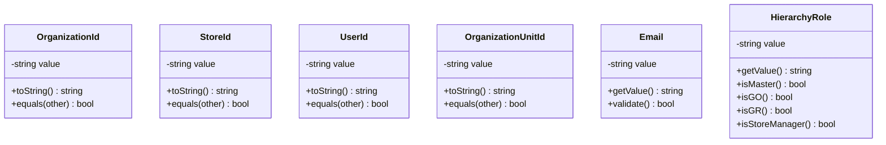
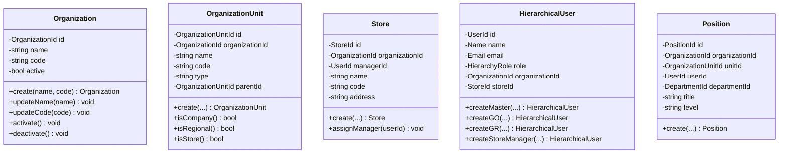

# Organization Hierarchy - Domain-Driven Design Architecture

## Overview

The Madnezz system implements a multi-organization hierarchy with four main levels:
- **MASTER**: Super-admin with access to all organizations
- **GO** (Gestor Organizacional): Organization manager
- **GR** (Gerente Regional): Regional manager
- **STORE_MANAGER**: Store manager

## Domain Model

### Value Objects



### Entities



### Aggregates and Relationships


## Repository Pattern


## Use Cases


## Factory Pattern


## Middleware Architecture


## Context-Based Filtering


## Permission Inheritance


## Database Schema

```sql
-- Organizations
CREATE TABLE organizations (
    id UUID PRIMARY KEY,
    name VARCHAR(255) NOT NULL,
    code VARCHAR(50) UNIQUE NOT NULL,
    active BOOLEAN DEFAULT true,
    created_at TIMESTAMP,
    updated_at TIMESTAMP
);

-- Organization Units (Hierarchical)
CREATE TABLE organization_units (
    id UUID PRIMARY KEY,
    organization_id UUID REFERENCES organizations(id),
    parent_id UUID REFERENCES organization_units(id),
    name VARCHAR(255) NOT NULL,
    code VARCHAR(50) NOT NULL,
    type ENUM('company', 'regional', 'store') NOT NULL,
    active BOOLEAN DEFAULT true,
    created_at TIMESTAMP,
    updated_at TIMESTAMP,
    UNIQUE(organization_id, code)
);

-- Stores
CREATE TABLE stores (
    id UUID PRIMARY KEY,
    organization_id UUID REFERENCES organizations(id),
    manager_id UUID REFERENCES users_ddd(id),
    name VARCHAR(255) NOT NULL,
    code VARCHAR(50) UNIQUE NOT NULL,
    address VARCHAR(255),
    city VARCHAR(100),
    state VARCHAR(2),
    zip_code VARCHAR(10),
    phone VARCHAR(20),
    active BOOLEAN DEFAULT true,
    created_at TIMESTAMP,
    updated_at TIMESTAMP
);

-- Users with Hierarchy
CREATE TABLE users_ddd (
    id UUID PRIMARY KEY,
    name VARCHAR(255) NOT NULL,
    email VARCHAR(255) UNIQUE NOT NULL,
    password VARCHAR(255) NOT NULL,
    hierarchy_role ENUM('MASTER', 'GO', 'GR', 'STORE_MANAGER') NOT NULL,
    organization_id UUID REFERENCES organizations(id),
    store_id UUID REFERENCES stores(id),
    permissions JSON,
    context_data JSON,
    active BOOLEAN DEFAULT true,
    created_at TIMESTAMP,
    updated_at TIMESTAMP
);

-- Positions
CREATE TABLE positions (
    id UUID PRIMARY KEY,
    organization_id UUID REFERENCES organizations(id),
    organization_unit_id UUID REFERENCES organization_units(id),
    user_id UUID REFERENCES users_ddd(id),
    title VARCHAR(255),
    level VARCHAR(50),
    active BOOLEAN DEFAULT true,
    created_at TIMESTAMP,
    updated_at TIMESTAMP
);

-- Departments
CREATE TABLE departments (
    id UUID PRIMARY KEY,
    organization_id UUID REFERENCES organizations(id),
    name VARCHAR(255) NOT NULL,
    code VARCHAR(50) NOT NULL,
    type VARCHAR(50),
    active BOOLEAN DEFAULT true,
    created_at TIMESTAMP,
    updated_at TIMESTAMP
);

-- Position-Department Relationship
CREATE TABLE position_departments (
    position_id UUID REFERENCES positions(id),
    department_id UUID REFERENCES departments(id),
    PRIMARY KEY (position_id, department_id)
);
```

## Integration Flow


## Security and Access Control

### Role-Based Access Matrix

| Resource | MASTER | GO | GR | Store Manager |
|----------|--------|----|----|---------------|
| Create Organization | ✅ | ❌ | ❌ | ❌ |
| Update Organization | ✅ | ❌ | ❌ | ❌ |
| Create Region | ✅ | ✅ | ❌ | ❌ |
| Create Store | ✅ | ✅ | ❌ | ❌ |
| View All Stores | ✅ | ✅ | ❌ | ❌ |
| View Regional Stores | ✅ | ✅ | ✅ | ❌ |
| View Own Store | ✅ | ✅ | ✅ | ✅ |
| Manage Store | ✅ | ✅ | ✅ | ✅ |

### Context Filtering Rules

1. **MASTER**: No filtering - sees all data
2. **GO**: Filtered by organization_id
3. **GR**: Filtered by organization_id and regional unit
4. **Store Manager**: Filtered by organization_id and store_id